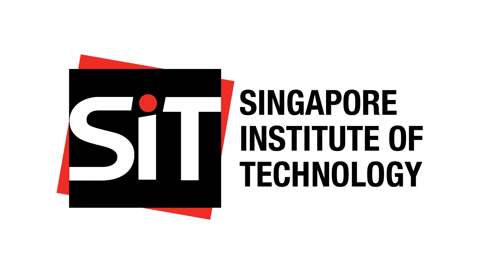

::: {style="float:left; position: relative; top: 0px"}
{align: left="" style="margin-right\": 10px" fig-alt="why no image" height="100"}
:::

The Singapore Institute of Technology (SIT) is Singapore’s first University of Applied Learning and the third largest university by intake in Singapore. SIT’s mission is to maximise the potential of our learners and to innovate with industry, through an integrated applied learning and research approach, so as to contribute to the economy and society.

\
